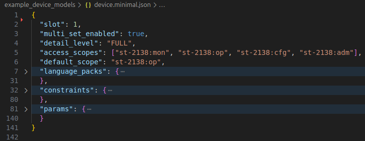
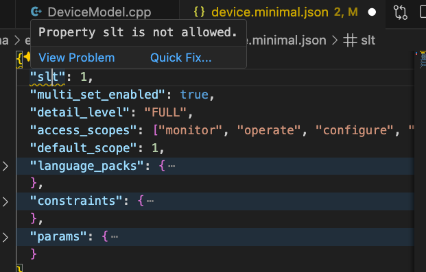
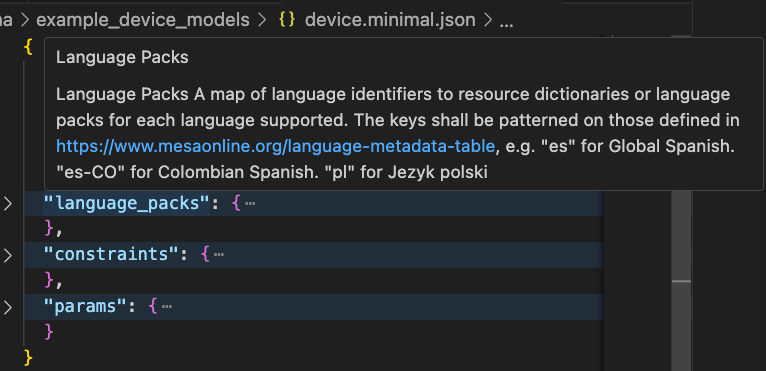
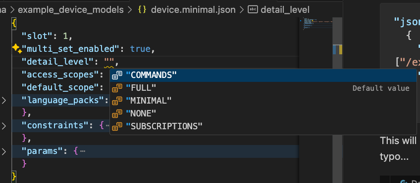

::: {.image-wrapper style="background-color: black; padding: 5px;"}
{style="width: 100%;"}
:::

# The Device Model

> Defined in `interface/device.proto`.


As previously mentioned, it's possible to represent a device model using human-authored JSON.

The example service, `full_service` that's part of Catena's C++ SDK imports and initializes itself from JSON files and then provides access to it using the RPCs defined in `interface/service.proto`.

There are some example device models in JSON such as `device.minimal.json`.



It's possible to validate the JSON device models against a set of schemata in the `schema` directory. This defines the top-level schema for device models and param.

If you're using `vscode` it's possible to have intellisense mark up device models by including this snippet in your `settings.json`.

```json
"json.schemas": [
  {
    "fileMatch": [
      "/example_device_models/device.*.json",
    ],
    "url": "./schema/catena.device_schema.json"
  },
  {
    "fileMatch": [
      "/example_device_models/**/param.*.json",
    ],
    "url": "./schema/catena.param_schema.json"
  }
]
```

This will cause incorrect code to be highlighted like this typo...



... and show tooltips and auto-completion options






<div style="text-align: center">

[Next Page: Device Model Validation](Validation.html)

</div>