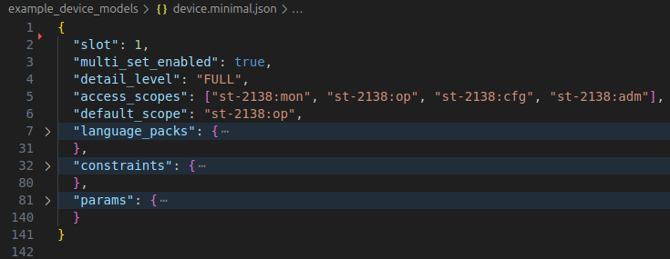

::: {.image-wrapper style="background-color: black; padding: 5px;"}
{style="width: 100%;"}
:::

# The Device Model

> Defined in `smpte/interface/proto/device.proto`.


As previously mentioned, it's possible to represent a device model using human-authored JSON and YAML.

The example service, `full_service` that's part of Catena's C++ SDK imports and initializes itself from JSON files and then provides access to it using the RPCs defined in `smpte/interface/proto/service.proto`.

There are some example device models in JSON and YAML such as `device.minimal.json`.



It's possible to validate the JSON and YAML device models against a set of schemata in the `schema` directory. This defines the top-level schema for device models and param.

If you're using `vscode` it's possible to have intellisense mark up JSON device models by including this snippet in your `settings.json`.

```json
"json.schemas": [
  {
    "fileMatch": [
      "/sdks/cpp/common/examples/**/device.*.json",
      "/sdks/cpp/connections/gRPC/examples/**/device.*.json",
      "/sdks/cpp/connections/REST/examples/**/device.*.json"
    ],
    "url": "./smpte/interface/schemata/device.json"
  },
  {
    "fileMatch": [
      "/sdks/cpp/common/examples/**/param.*.json",
      "/sdks/cpp/connections/gRPC/examples/**/param.*.json",
      "/sdks/cpp/connections/REST/examples/**/param.*.json"
    ],
    "url": "./smpte/interface/schemata/param.json"
  }
],
```
This will cause incorrect code to be highlighted like this typo...


... and show tooltips and auto-completion options


This is also possible with YAML device models using the modified snippet.
```json
"yaml.schemas": {
    "./smpte/interface/schemata/device.yaml" : [
      "/sdks/cpp/common/examples/**/device.*.yaml",
      "/sdks/cpp/connections/gRPC/examples/**/device.*.yaml",
      "/sdks/cpp/connections/REST/examples/**/device.*.yaml"
    ],
    "./smpte/interface/schemata/param.yaml" : [
      "/sdks/cpp/common/examples/**/param.*.yaml",
      "/sdks/cpp/connections/gRPC/examples/**/param.*.yaml",
      "/sdks/cpp/connections/REST/examples/**/param.*.yaml"
    ]
}
```
However, the recommended Red Hat extension redhat.vscode-yaml is required for it to function. This can be installed either through vscode directly or by using the command `code --install-extension redhat.vscode-yaml`.

<div style="text-align: center">

[Next Page: Device Model Validation](Validation.html)

</div>