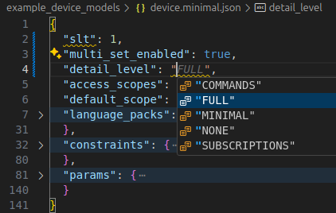

# The Device Model


Defined in `interface/device.proto`.

As previously mentioned, it's possible to represent a device model using human-authored JSON.

The example service, `full_service` that's part of Catena's C++ SDK imports and initializes itself from JSON files and then provides access to it using the RPCs defined in `interface/service.proto`.

There are some example device models in JSON such as `device.minimal.json`.


It's possible to validate the JSON device models against a set of schemata in `schema/catena.schema.json`. This defines the top-level schema for device models, and many sub-schemata for the many different objects that compose a device model.

If you're using `vscode` it's possible to have intellisense mark up device models by including this snippet in your `settings.json`.

```json
"json.schemas": [
  {
    "fileMatch": ["/example_device_models/device.*.json"],
    "url": "./schema/catena.schema.json"
  }
]
```

This will cause incorrect code to be highlighted like this typo...


... and show tooltips and auto-completion options





<div style="text-align: center">

[Next Page](Validation.md)

</div>