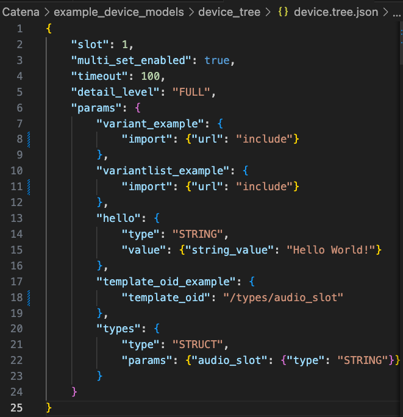

::: {.image-wrapper style="background-color: black; padding: 5px;"}

:::

# Templated Parameters

The [previous page](Validation.md) also showed an example of some limited inheritance that is part of Catena's device modeling language.

Line 17 shows a parameter named `template_oid_example` getting its descriptor from a parameter at `/types/audio_slot`.

The motivation is to enable reuse of parameter descriptors and save on file size and message size for data models. It also allows multiple parameters to have their descriptors changed by making changes just to the descriptor referenced by the `template_oid`.

> Note that the JSON pointer used to locate the referenced parameter is missing some parts.
> This is intentional. 
> It strips out redundant information which saves space both on disk and on the wire
> The SDKs know how to use the logical JSON pointers to navigate the model correctly.

Templated parameters are __not__ currently supported in the C++ SDK, [issue #91](https://github.com/rossvideo/Catena/issues/91).

[Next Page: Param Descriptors](Params.md)

