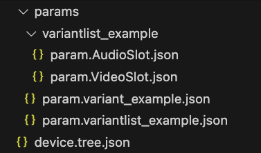

::: {.image-wrapper style="background-color: black; padding: 5px;"}
{style="width: 100%;"}
:::
# Multi-part Device Models and the Validator

Device models can quickly become too large to manage.

For this reason, Catena supports the import directive. At time of writing, only `Param` objects can be imported.

The following device model shows two imported parameters: `variant_example` and `variantlist_example`.


The C++ SDK recognizes the (badly formatted, for a url) import value `include` to import the component of the device model locally. The rules being:

- If this is the root device model, look in the `params` sub-folder for a file with the same name as the imported param with a `param.` prefix and `.json` extension.
- If I'm lower than the root because a param is importing another param, look in the sub-folder with the same name as the importing param and for files named for the imported child param again with the `param.` prefix and `.json` extension.

This shows the file system for the `device_tree.json` example:



I wish the file `device.tree.json` started this screengrab to show that it's in the local root folder that contains the `params` folder. But we can't have everything.

It used to be possible to have `vscode` apply sub-schemas from a schema file. That functionality disappeared sometime around 2022 so to validate JSON files that do not contain device models we can use the valiation tool that is included in this repo.

`validate.js` uses the first part of its target's filename to select the schema (or sub-schema) it will apply. So, to check whether the `param.AudioSlot.json` is valid here we can run it like this:

```sh
Catena % node validate.js ./example_device_models/device_tree/par
ams/variantlist_example/param.AudioSlot.json
applying: param schema to input file ./example_device_models/device_tree/params/variantlist_example/param.AudioSlot.json
data was valid.
```

`validate.js` uses the `ajv` module to perform the validation.

<div style="text-align: center">

[Next Page: Template Parameters](Template.html)

</div>