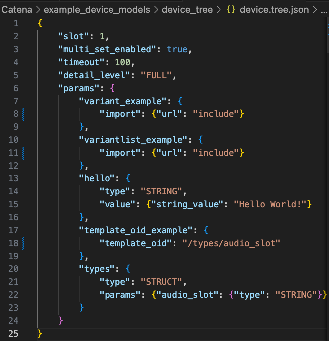
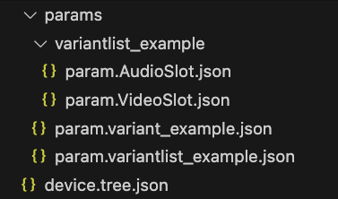
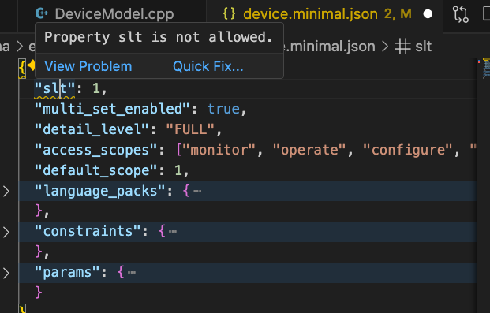
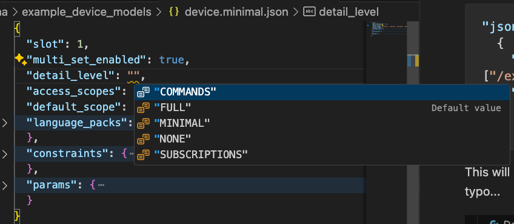
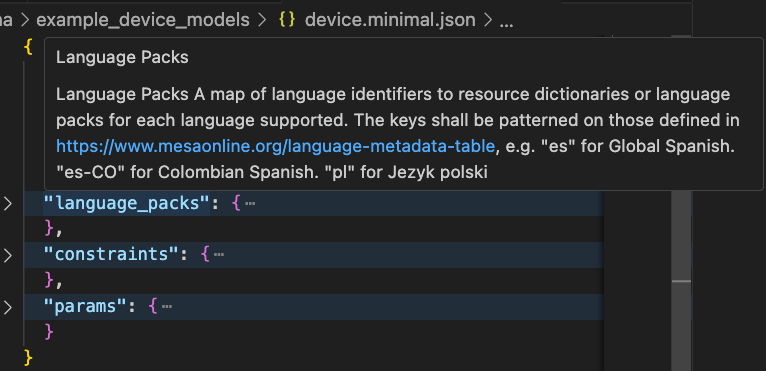

::: {.image-wrapper style="background-color: black; padding: 5px;"}
{style="width: 100%;"}
:::
# Multi-part Device Models and the Validator

Device models can quickly become too large to manage.

For this reason, Catena supports the import directive. At time of writing, only `Param` objects can be imported.

The following device model shows two imported parameters: `variant_example` and `variantlist_example`.



The C++ SDK recognizes the (badly formatted, for a url) import value `include` to import the component of the device model locally. The rules being:

- If this is the root device model, look in the `params` sub-folder for a file with the same name as the imported param with a `param.` prefix and `.json` extension.
- If I'm lower than the root because a param is importing another param, look in the sub-folder with the same name as the importing param and for files named for the imported child param again with the `param.` prefix and `.json` extension.

This shows the file system for the `device_tree.json` example:



I wish the file `device.tree.json` started this screengrab to show that it's in the local root folder that contains the `params` folder. But we can't have everything.

It used to be possible to have `vscode` apply sub-schemas from a schema file. That functionality disappeared sometime around 2022 so to validate JSON files that do not contain device models we can use the valiation tool that is included in this repo.

`validate.js` uses the first part of its target's filename to select the schema (or sub-schema) it will apply. So, to check whether the `param.AudioSlot.json` is valid here we can run it like this:

```sh
Catena % node validate.js ./example_device_models/device_tree/par
ams/variantlist_example/param.AudioSlot.json
applying: param schema to input file ./example_device_models/device_tree/params/variantlist_example/param.AudioSlot.json
data was valid.
```

`validate.js` uses the `ajv` module to perform the validation.

<div style="text-align: center">

[Next Page: Template Parameters](Template.html)

</div>

::: {.image-wrapper style="background-color: black; padding: 5px;"}
{style="width: 100%;"}
:::

# Validating Device Models

## About ST2138-a

SMPTE ST 2138 (also known as the **Catena standard**) is an emerging standard by the Society of Motion Picture and Television Engineers that defines a standardized control plane for media devices and services. The ST2138-a specification provides schema definitions for plug-and-play communication and control of media services and devices across cloud, on-premises, and hybrid platforms.

The Catena specification is currently in discussion with OSA with the goal of SMPTE standardization. You can learn more about ST2138-a at:

- [SMPTE ST 2138-a GitHub Repository](https://github.com/SMPTE/st2138-a)

The standard defines a comprehensive device model structure using protocol buffers and JSON schemas. Device models must conform to these schemas to ensure interoperability between different implementations and manufacturers.

---

## Why a Validator

Device models can quickly become complex, spanning multiple files with hundreds of parameters, constraints, commands, and menu structures. Manual verification of these models is error-prone and time-consuming. A validator is essential for several reasons:

### 1. **Catch Errors Early**

The validator ensures your device model conforms to the ST2138-a schema before attempting to generate code or deploy the model. This catches:

- Type mismatches (e.g., using a string where an integer is required)
- Missing required fields (e.g., mandatory product information)
- Invalid enum values
- Incorrect nested structures
- Schema constraint violations



*Example: VSCode highlighting a validation error in a device model*

### 2. **Multi-part Device Model Support**

Catena supports the import directive to break large device models into manageable parts. Currently, `Param` objects can be imported. The validator checks both:

- The root device model file
- All imported parameter files

The following device model shows two imported parameters: `variant_example` and `variantlist_example`:


The import structure follows these rules (implemented in [DeviceModel.js](../tools/codegen/DeviceModel.js#L55-L90)):

- Root device model: Look in the `params` sub-folder for files named `param.<name>.json` or `param.<name>.yaml`
- Nested imports: Look in sub-folders matching the parent param name

File system for `device_tree.json` example:


### 3. **IDE Integration**

With proper configuration, validators provide real-time feedback in your IDE:

- **Auto-completion**: Suggests valid properties and values



- **Tooltips**: Shows documentation for each field



- **Inline error highlighting**: Marks invalid syntax immediately

### 4. **Prevent Runtime Errors**

Many issues that would cause runtime failures are caught at validation time:

- Invalid JSON pointer references
- Circular dependencies in imports
- Authorization scope misconfigurations
- Constraint reference errors

The validation logic is integrated into the code generation pipeline in [index.js](../tools/codegen/index.js#L173-L187), ensuring no invalid models make it to production.

---

## Required Parts for a Valid Device Model

According to the ST2138-a specification and enforced by the [validation logic](../tools/codegen/index.js#L80-L167), a valid device model must include:

### 1. **Device Metadata**

- **`slot`**: Device slot number
- **`default_scope`**: Default access scope (e.g., `"st2138:mon"`)
- **`detail_level`**: Default detail level for responses
- **`access_scopes`**: Array of supported access scopes
- **`multi_set_enabled`**: Boolean indicating multi-set support
- **`subscriptions`**: Boolean indicating subscription support

### 2. **Mandatory Product Parameters**

The `product` parameter must be a read-only STRUCT containing:

| Parameter | Type | Required | Description |
|-----------|------|----------|-------------|
| `name` | STRING | Yes | Product name |
| `vendor` | STRING | Yes | Manufacturer name |
| `version` | STRING | Yes | Firmware/software version |
| `serial_number` | STRING | Yes | Unique device serial number |
| `catena_sdk` | STRING | No | SDK implementation name |
| `catena_sdk_version` | STRING | No | SDK version |

All product parameters must have an access scope of `"st2138:mon"` (monitor) or inherit it from parent scopes.

Example from [use_constraints](../sdks/cpp/common/examples/use_constraints/device.use_constraints.json):

```json
{
  "slot": 1,
  "default_scope": "st2138:mon",
  "params": {
    "product": {
      "type": "STRUCT",
      "read_only": true,
      "access_scope": "st2138:mon",
      "params": {
        "name": { "type": "STRING" },
        "vendor": { "type": "STRING" },
        "version": { "type": "STRING" },
        "serial_number": { "type": "STRING" }
      },
      "value": {
        "struct_value": {
          "fields": {
            "name": { "string_value": "My Device" },
            "vendor": { "string_value": "Ross Video" },
            "version": { "string_value": "1.0.0" },
            "serial_number": { "string_value": "12345" }
          }
        }
      }
    }
  }
}
```

### 3. **Valid Parameter Types**

All parameters must use one of the supported types defined in the protobuf specification:

- Scalar: `INT32`, `INT64`, `FLOAT32`, `FLOAT64`, `STRING`, `BOOLEAN`
- Complex: `STRUCT`, `VARIANT`, `ARRAY`
- Special: Commands and external objects

See [param.proto](../smpte/interface/proto/param.proto) for complete type definitions.

### 4. **Proper File Naming Convention**

Files must follow the naming pattern for schema detection:

- Device models: `device.<name>.json` or `device.<name>.yaml`
- Parameter imports: `param.<name>.json` or `param.<name>.yaml`
- Constraint definitions: Follow schema requirements

The [validator](../smpte/tools/validator.js#L56-L84) extracts the schema name from the first part of the filename.

### 5. **Valid References**

All references must resolve correctly:

- Constraint references (`constraint_ref`)
- Template references
- Import paths
- JSON pointers in commands

---

## How to Run the Validator

There are multiple ways to validate your device models:

### Method 1: Command-Line Validation (Standalone)

The standalone validator is located in [smpte/tools/validate.js](../smpte/tools/validate.js).

**Usage:**

```bash
cd /home/jasonchen/Catena
node smpte/tools/validate.js <path-to-your-file>
```

**Examples:**

Validate a device model:
```bash
node smpte/tools/validate.js ./sdks/cpp/common/examples/hello_world/device.hello_world.json
# Output:
# Applying schema 'device' to file './sdks/cpp/common/examples/hello_world/device.hello_world.json'
# ✅ Validation succeeded.
```

Validate a parameter file:
```bash
node smpte/tools/validate.js ./example_device_models/device_tree/params/variantlist_example/param.AudioSlot.json
# Output:
# Applying schema 'param' to file './example_device_models/device_tree/params/variantlist_example/param.AudioSlot.json'
# ✅ Validation succeeded.
```

Validate a YAML file:
```bash
node smpte/tools/validate.js ./sdks/cpp/connections/gRPC/examples/one_of_everything/device.one_of_everything.yaml
```

**How it works:**

The validator (implemented in [validator.js](../smpte/tools/validator.js)):

1. Extracts the schema name from the filename prefix (e.g., `device`, `param`)
2. Loads the appropriate schema from [device.json](../smpte/interface/schemata/device.json)
3. Parses the input file (supports both JSON and YAML)
4. Uses [AJV (Another JSON Validator)](https://ajv.js.org/) to validate against the schema
5. Reports errors with line numbers using source maps

### Method 2: NPM Package (Published Validator)

Install the official ST2138-a validator globally:

```bash
npm install -g smpte-st2138-a-validator
```

Then run:

```bash
st2138-a-validate ./path/to/device.good.yaml
```

Or use npx without installation:

```bash
npx smpte-st2138-a-validator ./path/to/device.good.yaml
```

This uses the published schema from the SMPTE GitHub repository.

### Method 3: Integrated Code Generation

When generating code, validation happens automatically. The [codegen tool](../tools/codegen/index.js) validates before generating:

```bash
cd /home/jasonchen/Catena/tools/codegen
node index.js --device-model ../../sdks/cpp/common/examples/hello_world/device.hello_world.json --output ./output
```

**Output:**
```
Validating device model 'device' from file '../../sdks/cpp/common/examples/hello_world/device.hello_world.json'...
Applying schema 'device' to file '../../sdks/cpp/common/examples/hello_world/device.hello_world.json'
✅ Validation succeeded.
Generating code...
✅ Code generation completed.
```

The validation includes:
- Schema conformance check
- Mandatory parameter enforcement (see [validateRequiredParamsAndScopes](../tools/codegen/index.js#L80-L167))
- Import resolution for multi-part models

To disable mandatory parameter enforcement during development:

```bash
node index.js --device-model ./device.test.json --disable-mandatory-enforcement --output ./output
```
---

<div style="text-align: center">

[Next Page: Template Parameters](Template.html)

</div>