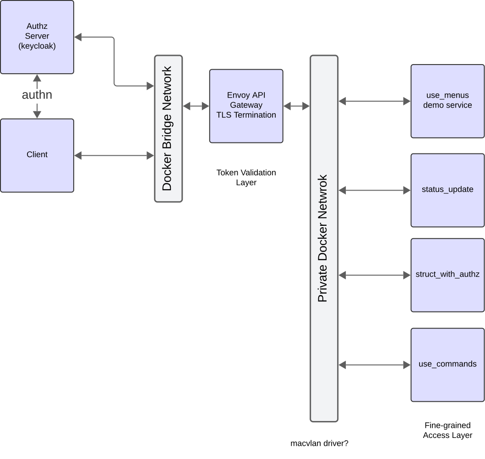

# Using Docker With The Catena C++ SDK

## Terminal
### Requirements
- Install [Docker](https://docs.docker.com/get-docker/) and add it to your system path.
- If on Linux, make sure to [enable docker as non-root user](https://docs.docker.com/engine/install/linux-postinstall/#manage-docker-as-a-non-root-user).

## VSCode
### Recommended Extensions
- [Docker](https://marketplace.visualstudio.com/items?itemName=ms-azuretools.vscode-docker). Additionally, follow the Docker software install instructions listed in the extension if not already set up.
- [Cmake Tools](https://marketplace.visualstudio.com/items?itemName=ms-vscode.cmake-tools) for build setup.

## Setting up and Running
### Setting up Catena Service(s) with Docker
The diagram below outlines the Catena architecture for containers as well as JWS token authentication.

<div style="text-align: center">



</div>

Setting up a Catena service(s) with Docker requires four things:
1. A keycloak server to generate public keys with.
2. A container set up with Envoy proxy for recieving requests via TLS, validating JWS tokens with the keycloak server, and routing valid requests to their respective service. This can be configured via an [envoy.yaml](https://github.com/rossvideo/Catena/blob/main/sdks/cpp/connections/docker/envoy.yaml) file.
3. A public and private Docker network for communication between containers.  
4. A [Docker compose](https://github.com/rossvideo/Catena/blob/main/sdks/cpp/connections/docker/grpc_compose.yml) file to create the containers, connect the service containers to the private network, and connect the Envoy proxy to both networks.

For an example of Catena services set up with a Docker image, see the [connections/docker](https://github.com/rossvideo/Catena/tree/main/sdks/cpp/connections/docker) folder.

***Note:*** If you wish to run your service without authentication/authorization, you can ignore the keycloak server and Envoy proxy container and simply connect your Catena sevice(s) to the public network. In this case, your service's should also be run with ```--authz=false```.

### Steps to run
1. Build Catena with ```cmake -DDOCKER=on```.
2. Navigate to the folder containing your Docker compose file.
3. Run the file using ```docker-compose -f /path/to/your/file up -d```.

Once your containers are created, you can check their status using ```docker ps -a```. You should have one container per service as well as an additional container running Envoy Proxy.

If one or more of these containers have exited, you can debug using ```docker logs <container name>```.
